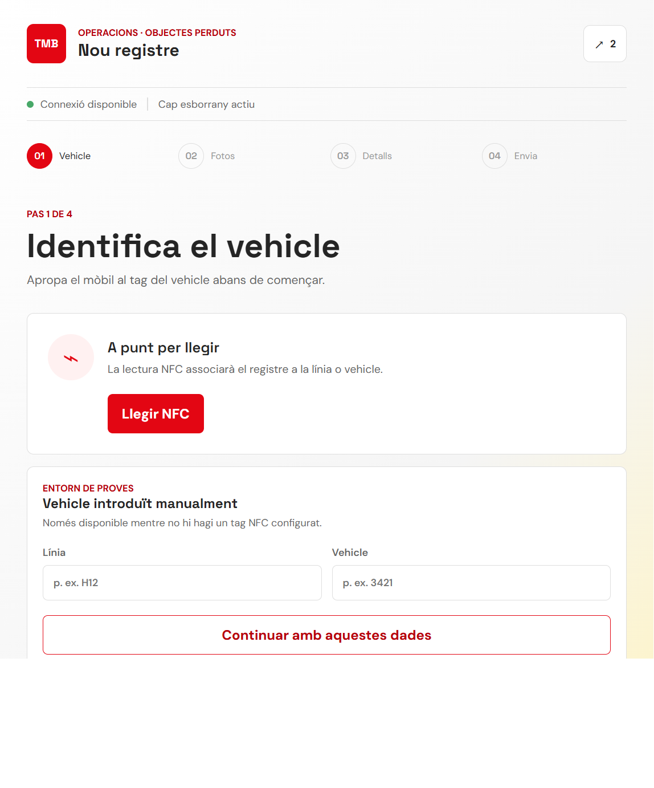
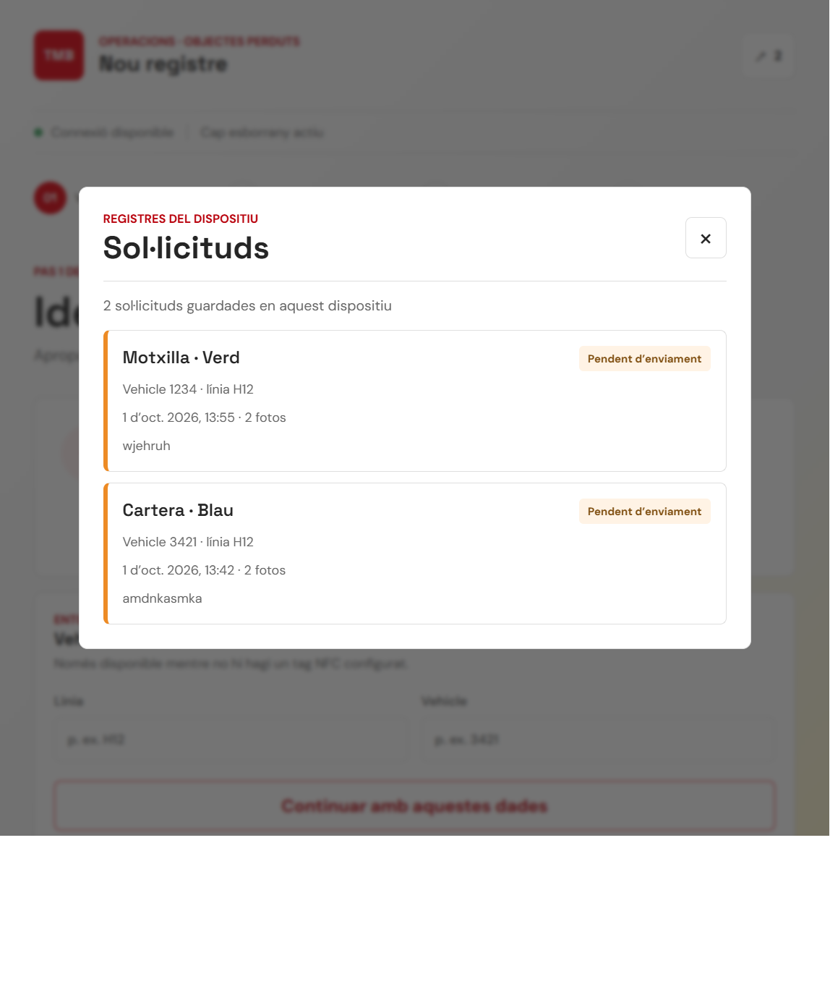

<<<<<<< HEAD
# TMB Lost & Found — app Android

App de registre d'objectes perduts per a operaris de TMB (NFC del vehicle → 2 fotos → etiquetes → enviament a l'API, amb funcionament sense connexió).

Obrir **aquesta carpeta** (`client/android`) amb Android Studio i executar `app`.
=======
# WP4 — Aplicació i interacció amb les persones usuàries

El WP4 s’encarrega de la part de l’aplicació amb què interactuen les persones: les
pantalles, els formularis, la captura d’imatges i la presentació clara de l’estat de
les sol·licituds. L’objectiu és que registrar o cercar un objecte sigui senzill des
del mòbil.

L’aplicació es planteja amb dues àrees: una d’ús intern per a TMB i una altra per a
les persones que han perdut un objecte. La primera s’està desenvolupant ara; la
segona és una funcionalitat prevista.

## Captura de la interfície actual

La imatge mostra la pantalla inicial de l’àrea TMB per identificar el vehicle i
començar un registre.



La fletxa de la capçalera obre el resum dels registres desats al dispositiu:



En aquesta captura els dos registres apareixen com a pendents perquè l’API encara
no està connectada. Quan l’enviament estigui integrat, aquesta vista també podrà
indicar quins registres s’han enviat correctament.

## Àrea TMB: registre per part dels operaris

La primera part de l’aplicació està pensada per als operaris de TMB que registren
objectes trobats al final de la jornada. El flux permet:

- Identificar el vehicle amb NFC o, per a proves, introduir-ne manualment la línia i
	l’identificador.
- Fer i revisar dues fotografies de l’objecte.
- Seleccionar el color, el tipus d’objecte i el material principal.
- Afegir una descripció opcional de fins a 250 caràcters.
- Revisar les dades i desar el registre al dispositiu si no hi ha connexió.
- Consultar un resum dels registres guardats i saber si estan pendents o s’han enviat.

Actualment, el client és una aplicació web instal·lable (PWA) i la integració amb
l’API és provisional. Sense un backend configurat, els registres queden desats al
navegador del dispositiu i no es comparteixen amb altres persones.

## Àrea per a clients: trobar un objecte perdut

En una fase posterior volem afegir una part de l’aplicació adreçada a la persona que
ha perdut un objecte. Des d’aquesta àrea, el client podrà enviar una sol·licitud de
cerca: descriure l’objecte, seleccionar-ne el color, el tipus i el material, i
adjuntar-hi una fotografia de referència si en té. Els camps previstos coincideixen
amb les etiquetes utilitzades en el registre dels objectes trobats.

La sol·licitud s’hauria d’enviar al backend perquè es pugui connectar amb els
components de cerca del projecte i mostrar possibles coincidències. Aquesta àrea de
clients encara no està implementada: cal acordar amb els equips de backend i cerca
el contracte de dades, la manera de presentar els resultats i com es gestionaran
les fotografies aportades.

## Tecnologies i execució

El client actual utilitza HTML, CSS i JavaScript sense dependències externes. La
separació en fitxers manté la interfície independent de les integracions:

- `index.html`: pantalles i formularis del flux actual.
- `app.js`: lògica d’interfície i adaptadors per a NFC, cua local i API.
- `styles.css`: estils responsive i colors de la interfície.
- `manifest.webmanifest`: configuració per instal·lar el client com a PWA.

Per executar-lo localment, des de `client/`:
>>>>>>> 9685d59 (Document WP4 interface and goals)

```bash
./gradlew assembleDebug        # compilar
./gradlew testDebugUnitTest    # tests unitaris
```

<<<<<<< HEAD
Per defecte usa una API simulada (`lostfound.useMockApi=true` a `gradle.properties`).

Documentació completa: [`docs/app-mobil/`](../../docs/app-mobil/README.md)
=======
Obre `http://localhost:4173`. En un mòbil, la càmera i Web NFC requereixen una
connexió HTTPS, excepte quan s’executa a `localhost`. El vehicle manual permet provar
el flux sense un tag NFC.

## Integracions pendents

- Configurar l’URL i el contracte definitius de l’API amb l’equip de backend. No es
	fan peticions mentre no hi hagi una API configurada.
- Acordar el format dels tags NFC. La lectura actual accepta provisionalment text
	JSON (`{"line":"H12","vehicle":"3421"}`) o el número de sèrie del tag.
- Definir el contracte de cerca i la presentació de coincidències amb l’equip de
	cerca abans d’implementar el flux per a reclamants.
- La revisió de les fotografies és manual. La detecció automàtica de fotos fosques o
	borroses encara no està implementada.
- La cua offline desa les imatges al navegador; per a ús real cal valorar una
	persistència més adequada per a fitxers grans i la sincronització en segon pla.
>>>>>>> 9685d59 (Document WP4 interface and goals)
