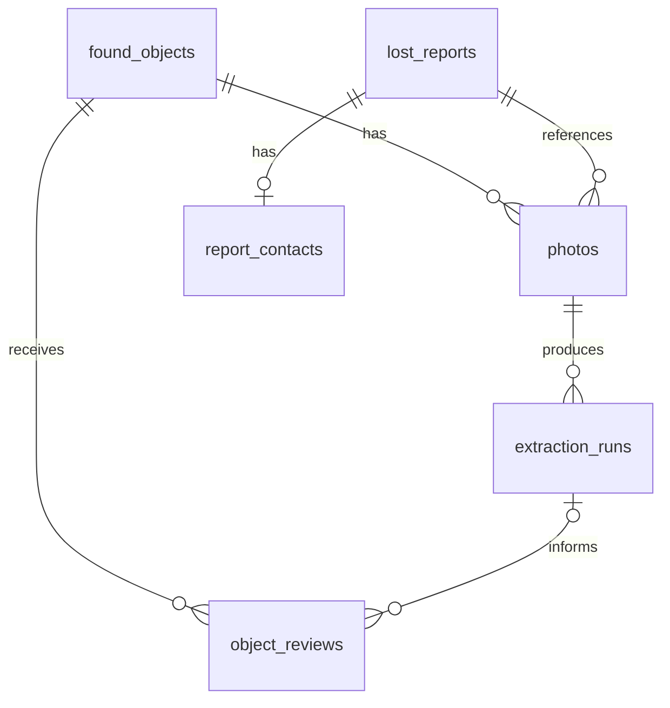

# Backbone de datos v0.1 — contrato propuesto para PostgreSQL

**Actualización de implementación (WP3):** las cuatro tablas de inventario, las
migraciones, el repositorio Python y la vista de búsqueda ya están implementados
en esta rama. Consulta [README.md](README.md) para ejecutarlos y conocer las
decisiones concretas de esta primera entrega. Este documento conserva el diseño
y el alcance futuro; la UI y el buscador todavía no usan PostgreSQL.

**Objetivo:** dar al equipo de base de datos un primer esquema implementable para
registrar objetos, conservar extracciones y revisiones, y proporcionar datos al
buscador. Este documento es una propuesta de contrato basada en el código actual;
no es una migración ejecutada ni significa que la aplicación ya use PostgreSQL.

Esta propuesta amplía el [borrador de modelo y operaciones de WP3](modelo-y-operaciones.md)
con los requisitos de la extracción y revisión que ya existen en `main`. Ambos
siguen pendientes de acuerdo; este documento no declara aprobado ni sustituye
silenciosamente el trabajo anterior. Diferencias que hay que resolver juntos:

- IDs de texto para admitir registros existentes, frente a UUID obligatorio.
- Hallazgo como columnas iniciales del objeto, frente a una tabla separada;
  ambas opciones sirven si mantienen las mismas reglas y vista de búsqueda.
- Descripción del formulario opcional y texto buscable revisado obligatorio,
  frente a una única descripción no vacía en el objeto.
- Fotos temporales antes del alta y extracciones/revisiones versionadas.
- Declaraciones y contactos como segunda fase explícita.

Las referencias de código al final apuntan a la versión `182dafe` de `main`,
porque esos componentes aún no forman parte de esta rama de documentación.

La primera entrega puede limitarse a las cuatro tablas de inventario. Las dos
tablas de declaraciones completan el contrato ciudadano, que se conectará después.
No hace falta esperar a un modelo completo de usuarios, transporte o devoluciones.

## 1. Alcance y decisiones de partida

| Decisión | Backbone inicial |
| --- | --- |
| Unidad de inventario | Un registro identifica un objeto encontrado; no se deduce identidad a partir de una foto parecida. |
| Separación de fuentes | Entrada recibida, salida automática y revisión humana se conservan por separado. |
| Datos para búsqueda | Solo la última revisión aprobada de un objeto activo; nunca el JSON bruto del modelo. |
| Fotos | Archivos fuera de PostgreSQL; en la BD se guardan referencias, hash y metadatos. |
| Varios colores | `text[]`, sin duplicados. No una cadena con colores separados por comas. |
| Campos desconocidos | `NULL` para un valor desconocido; array vacío para colores no informados. No inventar fechas o ubicaciones. |
| Categorías/materiales | Texto validado por backend contra el contrato compartido. Las etiquetas actuales son placeholders; no crear enums PostgreSQL ligados al idioma de la UI. |
| IDs | `text`: conservar los IDs estables que ya genera el cliente, incluidos los antiguos que no son UUID. Para entidades nuevas, backend puede generar UUID y guardarlos como texto. |
| Horas | `timestamptz` para eventos; `date` cuando solo conocemos el día. Fechas del cliente y del servidor separadas. |
| Búsqueda inicial | BM25 ya existe en Python. No se requieren embeddings, pgvector ni otro motor para esta entrega. |

Usar columnas normales para relaciones y campos consultables. Reservar `jsonb`
para snapshots y resultados variables del modelo, no para meter todo el inventario
en una sola columna. PostgreSQL documenta estos tipos en
[Data Types](https://www.postgresql.org/docs/current/datatype.html) y
[JSON Types](https://www.postgresql.org/docs/current/datatype-json.html).

## 2. Tablas y relaciones

Una foto pertenece a **un objeto o una declaración**, nunca a ambos. Antes del
registro definitivo puede estar temporalmente sin propietario: la UI extrae
atributos antes de guardar el objeto. El backend debe conservar esa asociación
temporal y finalizarla al recibir el registro; no necesita crear un objeto falso
para poder extraer. Las cardinalidades del diagrama muestran el estado final.

### 2.1 `found_objects` — inventario y contexto del registro

| Campo | Tipo orientativo | Obligatorio / significado |
| --- | --- | --- |
| `id` | `text`, PK | Sí. ID estable del registro; máximo 160 caracteres para compatibilidad actual. |
| `status` | `text` | Sí. `registered`, `returned` o `archived`; inicialmente `registered`. Es estado del objeto, no del envío HTTP. |
| `created_at` | `timestamptz` | Sí, generado por servidor al aceptar el registro. |
| `updated_at` | `timestamptz` | Sí, actualizado por backend al cambiar el registro o su revisión vigente. |
| `client_registered_at` | `timestamptz` | Opcional. `capturedAt` del registro actual; procede del reloj del cliente. |
| `registered_line` | `text` | Opcional. Línea indicada en el formulario del operario. |
| `registered_vehicle` | `text` | Opcional. Vehículo indicado en el formulario. |
| `vehicle_source` | `text` | Opcional. `manual` o `nfc`; no identifica al operario. |
| `found_date` | `date` | Opcional. Día real del hallazgo, si se conoce. |
| `date_quality` | `text` | Sí. `unknown`, `approximate` o `confirmed`. |
| `found_line` / `found_direction` | `text` | Opcionales. Contexto de hallazgo confirmado o informado explícitamente. |
| `found_location` | `text` | Opcional. Descripción libre de la ubicación del hallazgo. |
| `received_at` | `timestamptz` | Opcional. Recepción física en depósito/oficina, si se conoce. |
| `original_details` | `jsonb` | Sí. Snapshot inmutable de `details` recibido en el primer registro, sin bytes de fotos. Puede ser `{}` en una importación incompleta. |
| `submission_hash` | `text` | Sí. Hash de la petición de alta normalizada para reintentos idempotentes. |

`original_details` significa lo recibido por backend, no las pulsaciones originales
del operario: la UI puede haberlo rellenado y corregido antes del envío. El backend
actual no conserva un historial de cada edición; no inventarlo al migrar.

Reglas mínimas:

- `found_date IS NULL` si y solo si `date_quality = 'unknown'`.
- No copiar `created_at`, `client_registered_at` o `received_at` a `found_date`.
- No copiar automáticamente `registered_line` a `found_line`: hacerlo solo si se
  confirma que esa línea corresponde al hallazgo.
- `registered` significa registrado, no aprobación automática, disponibilidad
  física verificada o autorización de devolución.

### 2.2 `photos` — referencias a imágenes originales

| Campo | Tipo orientativo | Obligatorio / significado |
| --- | --- | --- |
| `id` | `text`, PK | Sí, generado por backend. |
| `object_id` | `text`, FK → `found_objects.id` | Opcional mientras esté en preparación o pertenezca a una declaración. |
| `report_id` | `text`, FK → `lost_reports.id` | Opcional mientras esté en preparación o pertenezca a un objeto. Añadir con la fase ciudadana. |
| `position` | `integer` | Sí, > 0; 1 es la foto principal. |
| `storage_key` | `text`, UNIQUE | Sí. Clave del archivo en almacenamiento controlado por backend; no una URL pública permanente. |
| `original_filename` | `text` | Opcional; solo informativo, no se usa como ruta de escritura. |
| `media_type` | `text` | Sí. MIME validado, por ejemplo `image/jpeg`. |
| `image_sha256` | `text` | Sí. SHA-256 de los bytes originales. No es el ID del objeto. |
| `size_bytes`, `width`, `height` | `bigint`, `integer`, `integer` | Sí, valores positivos obtenidos por backend. |
| `created_at` | `timestamptz` | Sí, recepción del archivo en servidor. |
| `client_selected_at` | `timestamptz` | Opcional. `photos[].capturedAt`; actualmente es selección/captura en UI, no fecha EXIF garantizada. |

En el estado final exactamente una FK de propietario debe estar informada. Para
fotos en preparación ambas pueden ser `NULL`; nunca permitir ambas informadas.
Imponer unicidad de `(object_id, position)` y `(report_id, position)` para los
propietarios presentes. Una foto adjunta no se reasigna a otro propietario.

El esquema permite N fotos; el backend actual limita el alta a 1–2 y la UI pide 2.
Solo `position = 1` se analiza ahora. Guardar ambas hace posible analizar más vistas
después sin rediseñar la tabla. En un JPG MPO se conserva el archivo original y
se prepara solo la imagen principal para inferencia.

Dos archivos con el mismo hash no prueban que dos registros representen el mismo
objeto. No hacer `image_sha256` globalmente único ni fusionar objetos por él.
Las fotos en preparación necesitan limpieza posterior si nunca se confirman;
la política de caducidad puede acordarse sin bloquear estas columnas.

### 2.3 `extraction_runs` — intentos automáticos y su procedencia

| Campo | Tipo orientativo | Obligatorio / significado |
| --- | --- | --- |
| `id` | `text`, PK | Sí. ID de este intento, generado por backend. |
| `photo_id` | `text`, FK → `photos.id` | Sí. Foto exacta utilizada. |
| `cache_key` | `text` | Opcional. Identidad de contenido/configuración usada para reutilizar una respuesta. No es el ID de propietario. |
| `source` | `text` | Sí. `operator` o `claimant`. |
| `status` | `text` | Sí. `pending`, `succeeded` o `failed`. |
| `model_name`, `model_digest` | `text` | Obligatorios en resultados completados. Registrar lo usado, no solo el modelo predeterminado actual. |
| `prompt_version`, `preprocessing_version` | `text` | Obligatorios en resultados completados; el contrato WP4 actual incorpora esquema y taxonomía en la versión. |
| `input_image_sha256` | `text` | Sí. Debe coincidir con el original referenciado. |
| `input_config` | `jsonb` | Sí, `{}` por defecto; permite registrar recorte/configuración adicional cuando se use. |
| `raw_output` | `jsonb` | Opcional hasta completar. Observaciones originales del modelo, sin reemplazarlas por correcciones. |
| `proposed_fields` | `jsonb` | Opcional hasta completar. Campos derivados para el formulario, separados del resultado bruto. |
| `quality` | `text` | Opcional hasta completar: `usable`, `insufficient`, `ambiguous`. |
| `sensitive_content` | `boolean` | Opcional hasta completar. Señal del modelo; no garantiza ausencia de información sensible. |
| `warnings`, `timings` | `jsonb` | `[]` y `{}` por defecto; avisos y métricas disponibles, sin tiempos inventados. |
| `error_message` | `text` | Opcional. Error operativo legible, sin copiar imágenes o respuestas personales. |
| `created_at`, `completed_at` | `timestamptz` | Inicio requerido; final opcional hasta terminar. |

Una foto puede tener varios intentos, modelos o versiones. Un intento completado
se conserva; reprocesar crea otro, sin sobrescribir revisiones anteriores.
Un fallo no impide registrar/revisar manualmente el objeto.

La caché actual usa un hash como `extractionId` antes de guardar el objeto. En el
adaptador PostgreSQL, la respuesta debe identificar un `extraction_runs.id` ligado
a la foto de esa petición; conservar el hash reutilizable como `cache_key`. Si se
reutiliza salida para otra foto con bytes iguales, crear una referencia de intento
para esa foto en vez de reasignar el intento original. Ajustar la resolución del
ID en backend; la UI lo trata como una referencia opaca. No copiar la validación
local de “64 caracteres hexadecimales” como restricción universal de los nuevos IDs.

### 2.4 `object_reviews` — decisiones humanas que alimentan la búsqueda

| Campo | Tipo orientativo | Obligatorio / significado |
| --- | --- | --- |
| `id` | `text`, PK | Sí. |
| `object_id` | `text`, FK → `found_objects.id` | Sí. |
| `revision` | `integer` | Sí, creciente por objeto; UNIQUE `(object_id, revision)`. |
| `status` | `text` | Sí. `approved` o `rejected`. |
| `source` | `text` | Sí. `manual` o `extraction`. |
| `extraction_id` | `text`, FK → `extraction_runs.id` | Requerido si source=`extraction`; `NULL` si manual. |
| `object_type`, `material` | `text` | Campos revisados; pueden ser desconocidos en datos importados. |
| `colors` | `text[]` | Sí, array sin duplicados; vacío si desconocidos. |
| `description` | `text` | Sí, puede estar vacío. La UI actual admite hasta 250 caracteres. |
| `search_text` | `text` | Sí. Texto revisado para búsqueda; no vacío si status=`approved`. |
| `reviewed_at` | `timestamptz` | Sí. Hora del servidor al recibir la decisión. |
| `reviewer_ref` | `text` | Opcional en prototipo sin cuentas; referencia del actor real cuando exista autenticación. |
| `review_seconds` | `numeric` | Opcional, >= 0; solo cuando se ha medido. |

No sobrescribir una revisión: añadir una nueva. Para asignar `revision`, serializar
las escrituras del mismo objeto dentro de la transacción; un `MAX + 1` sin bloqueo
puede competir con otro proceso. La revisión basada en extracción debe apuntar a
una foto del **mismo objeto**; validarlo al confirmar, no aceptar una FK cualquiera.

El checkbox actual acredita que se recibió una confirmación de revisión, no la
identidad autenticada de quien la hizo. Dejar `reviewer_ref` desconocido en esos
registros; no inventar un usuario ni llamarlo identidad verificada. La CLI actual
pide un texto de revisor; conservarlo como procedencia, no convertirlo en una cuenta.

Construir `search_text` de forma determinista con categoría, colores, material y
descripción **revisados**. No añadir un nombre libre del modelo si no está recogido
en la descripción revisada. Así una descripción opcional vacía no deja sin texto
un registro que sí tiene atributos confirmados. Una revisión rechazada puede tener
`search_text=''` y retira el objeto del índice.

### 2.5 `lost_reports` — declaraciones de personas que buscan un objeto

Se puede implementar después de las cuatro tablas anteriores. La UI ciudadana
actual guarda estos datos solo en el navegador; hace falta un endpoint futuro.

| Campo | Tipo orientativo | Obligatorio / significado |
| --- | --- | --- |
| `id` | `text`, PK | Sí. ID estable del cliente. |
| `status` | `text` | Sí. `open`, `closed`, `cancelled`; inicialmente `open`. No confirma propiedad. |
| `created_at`, `updated_at` | `timestamptz` | Sí, servidor. |
| `client_created_at` | `timestamptz` | Opcional. `createdAt` de la UI. |
| `original_description` | `text` | Sí, no vacía; conservar el texto tal como se envió. |
| `lost_date` | `date` | Opcional; fecha de pérdida, no de hallazgo. |
| `date_approximate` | `boolean` | Sí, false por defecto; la UI actual no pregunta precisión. |
| `location_text` | `text` | Opcional. Ubicación tal como la escribe la persona. |
| `line`, `direction` | `text` | Opcionales, solo si hay información explícita/normalizada; no deducirlos ciegamente de `location_text`. |
| `object_type` | `text` | Filtro opcional. |
| `colors` | `text[]` | Filtro opcional, array vacío por defecto. |
| `submission_hash` | `text` | Sí. Para reintentos de alta idempotentes. |

Su foto opcional va en `photos.report_id`, no en una columna con base64. Las
preferencias declaradas no son atributos confirmados de un objeto del inventario.
La búsqueda textual inicial puede usar `original_description`. Los filtros de tipo
y colores se conservan, aunque `SearchQuery` todavía no los recibe: no presentarlos
como filtros ya implementados en WP5.

### 2.6 `report_contacts` — contacto separado del texto buscable

| Campo | Tipo orientativo | Obligatorio / significado |
| --- | --- | --- |
| `report_id` | `text`, PK y FK → `lost_reports.id` | Una fila opcional por declaración. |
| `name`, `email`, `phone` | `text` | Opcionales, según lo aportado; si todos están vacíos no crear fila. |
| `created_at`, `updated_at` | `timestamptz` | Sí, servidor. |

No requiere crear una cuenta de usuario para declarar una pérdida. Backend restringe
el acceso a esta tabla; no la incluye en el índice, las entradas a Ollama o las
respuestas de candidatos. No hace falta diseñar ahora un sistema completo de usuarios.

## 3. Mapeo desde los formularios existentes

| Dato actual | Destino |
| --- | --- |
| Operario `id` | `found_objects.id`; clave idempotente de alta. |
| `capturedAt` | `found_objects.client_registered_at`, no `found_date`. |
| `vehicle.line`, `.vehicle`, `.source` | `registered_line`, `registered_vehicle`, `vehicle_source`. |
| `photos[].data` | Validar y decodificar; escribir archivo y crear/adoptar `photos`. No guardar la data URL en JSONB. |
| `photos[].capturedAt` | `photos.client_selected_at`. |
| `details` | Snapshot `original_details` y campos de la primera revisión, tras validar la confirmación. |
| `details.colors` | Array revisado. Adaptar la cola antigua `details.color` a una lista de un elemento. |
| `reviewed: true` | Crear revisión aprobada; el booleano solo no sustituye la fila de revisión ni identifica al actor. |
| `extractionId` | Resolver el intento y verificar que su foto coincide con la principal del registro. |
| `pending`, `sent`, `received-local` | Estados de sincronización/transporte; no copiarlos como estado físico del objeto. |
| Ciudadano `description`, `incident.lossDate`, `incident.location` | `original_description`, `lost_date`, `location_text`. |
| `filters.objectType`, `filters.colors` | Filtros opcionales de `lost_reports`. |
| `referencePhoto` | `photos` asociado a la declaración. |
| `contact` | `report_contacts`, separado del contenido buscable. |

La migración de JSON locales debe conservar IDs, hashes, versiones y revisiones
existentes cuando estén presentes. Los datos que nunca se recogieron siguen como
`NULL`. No inferir identidad del revisor, fechas de hallazgo ni historial de cambios.

## 4. Secuencias que debe soportar el backend

### Extraer antes de registrar

1. Recibir y validar la foto; guardar archivo y fila `photos` en preparación.
2. Crear `extraction_runs`, ejecutar Ollama y conservar el resultado o error.
3. Devolver el ID del intento y los campos propuestos. El objeto todavía no necesita existir.
4. La UI corrige/confirma campos y envía el registro con sus fotos y referencia.
5. Backend verifica pertenencia/hash de la foto y finaliza su asociación al objeto.

La UI actual vuelve a enviar los bytes de ambas fotos. El adaptador puede adoptar
la foto preparada de la extracción principal; no necesita crear otra fila para el
mismo adjunto en ese registro. No reutilizar una foto ya asignada a otro objeto.

### Confirmar un objeto e indexarlo

1. Validar ID, fotos, campos y confirmación. Preparar archivos antes de abrir una
   transacción larga; no mantener una transacción durante la llamada a Ollama.
2. En una transacción, insertar `found_objects`, asociar fotos y añadir la revisión.
3. Repetir el mismo ID y petición normalizada devuelve el registro existente;
   el mismo ID con contenido diferente devuelve conflicto, no sobrescritura.
   La comparación usa `submission_hash` inmutable, no los campos corregidos después.
4. Confirmar la transacción antes de responder que el registro se ha guardado.
5. Invalidar/reconstruir la instantánea BM25 cuando cambie una revisión o estado.
   Para el primer prototipo, reconstruir desde la vista en cada búsqueda evita
   necesitar colas o una tabla de sincronización del índice.

La huella de alta se calcula en backend sobre campos originales normalizados,
referencia de extracción y lista ordenada de hashes de fotos, excluyendo valores
como la hora de recepción del servidor o un estado de transporte añadido después.
Base de datos y archivos no comparten una transacción: backend debe limpiar archivos
huérfanos ante fallo y no declarar éxito hasta que las referencias sean válidas.

## 5. Vista de búsqueda: `searchable_objects`

El equipo de BD debe entregar una vista que seleccione primero la revisión con
mayor `revision` de cada objeto. Después filtra `status='approved'` en esa revisión
y `found_objects.status='registered'`. **No seleccionar primero las aprobadas**:
si la última fue rechazada, una aprobación antigua no puede reactivar el objeto.

La vista debe exponer:

| Columna | Origen / consumidor |
| --- | --- |
| `id` | ID del objeto → `FoundObject.id`. |
| `description` | `object_reviews.search_text` → `FoundObject.description`. |
| `found_date` | Fecha real o `NULL`. |
| `date_quality` | Precisión asociada a esa fecha. |
| `found_line`, `found_direction` | Contexto real conocido o `NULL`. |
| `review_id`, `revision` | Procedencia del texto indexado. |

Backend convierte `date` a `datetime.date` y entrega estos datos al contrato
[FoundObject](https://github.com/bertagodia/TMB-lost-found/blob/182dafe/search/models.py). La vista no debe incluir contactos, rutas
internas, fotos originales ni salidas brutas. Las fotos y detalles que se muestran
a un ciudadano requieren selección/autorización separada en backend.

El índice BM25 es derivado y reconstruible; no necesita ser una tabla fuente.
Tampoco hace falta persistir rankings ahora. Un candidato es un resultado de
búsqueda, no una correspondencia verificada ni una devolución autorizada.

## 6. Restricciones e índices que pedir a BD

Primera migración:

- PK y FK de las cuatro tablas de inventario; añadir la FK ciudadana de fotos
  al crear `lost_reports`. Evitar borrados en cascada que eliminen evidencia sin
  querer; usar estados `archived`/`cancelled` en el flujo normal.
- `CHECK` para estados, precisión de fechas, tamaños positivos, posición de foto,
  revisión positiva y duraciones no negativas.
- Regla de propietarios de foto, unicidad de posición por propietario y unicidad
  de número de revisión por objeto.
- Índices en FK de fotos, `extraction_runs(photo_id)`, y
  `object_reviews(object_id, revision DESC)`. El índice único de revisión puede
  cubrir la consulta equivalente; no duplicar índices sin necesidad.
- Índice no único en `photos(image_sha256)` y en `extraction_runs(cache_key)` para
  localizar entradas reutilizables. No convertir estos hashes en prueba de identidad.
- `searchable_objects` con las reglas del apartado anterior.

Backend valida límites actuales de fotos, listas de colores sin duplicados, valores
del formulario y correspondencia extracción/foto/objeto. Si BD puede reforzar las
reglas entre tablas con claves compuestas o triggers, acordarlo con backend: una
FK simple de `extraction_id` no comprueba por sí sola que pertenece al objeto revisado.
No hacen falta índices GIN de colores/JSONB hasta que haya consultas que los utilicen.

## 7. Entrega mínima y pruebas de aceptación

**BD:** migración versionada, diccionario de campos conforme a esta propuesta,
vista de búsqueda y datos ficticios. **Backend:** adaptador de persistencia,
almacenamiento de archivos, idempotencia y consultas de la vista. **WP5:** consumir
`FoundObject` revisados y devolver IDs/ranking. **UI:** revisión y corrección de
atributos, sin acceso directo a PostgreSQL.

La entrega inicial se considera útil si demuestra con fixtures:

1. Botella con dos fotos y tres colores, sin fecha de hallazgo conocida.
2. Extracción previa al alta, seguida de revisión: solo aparece en búsqueda tras aprobar.
3. Registro completamente manual después de un fallo de Ollama.
4. Segunda extracción con otro prompt sin perder el resultado ni la revisión anterior.
5. Nueva revisión que corrige colores; búsqueda usa la versión nueva.
6. Rechazo posterior que excluye el objeto aunque existiera una aprobación anterior.
7. Reintento de alta idéntico sin duplicados; mismo ID y distinto contenido da conflicto.
8. Una revisión no puede usar una extracción asociada a otro objeto.
9. Dos registros con la misma foto no se fusionan automáticamente.
10. Declaración ciudadana con contacto opcional separado y sin exponerlo en búsqueda
    (cuando se implementen las dos tablas ciudadanas).

No bloquean esta primera entrega: catálogos relacionales de líneas/vehículos,
cuentas y roles completos, historial de depósitos/traslados, verificación de
propiedad, tabla de coincidencias confirmadas, devoluciones detalladas, embeddings,
extracción multivista y migración desde SharePoint. Se añadirán con nuevas migraciones.
Las etiquetas catalanas siguen siendo placeholders y no necesitan un trabajo de
traducción para acordar este backbone.

## 8. Qué existe hoy y qué queda por implementar

Hoy el backend guarda JSON locales y la CLI tiene su propio inventario JSON.
La primera implementación de inventario está en `database/migrations/001_inventory.sql`
y `database/repository.py`, con pruebas reales de PostgreSQL. Aún falta conectar
este repositorio con el almacenamiento de archivos, el backend HTTP y BM25.
Las tablas ciudadanas y su endpoint continúan pendientes; no se ha cambiado el
formulario ciudadano ni la persistencia local actual.

Código de referencia: [backend/server.py](https://github.com/bertagodia/TMB-lost-found/blob/182dafe/backend/server.py),
[client/app.js](https://github.com/bertagodia/TMB-lost-found/blob/182dafe/client/app.js), [campos compartidos](https://github.com/bertagodia/TMB-lost-found/blob/182dafe/client/form-options.json),
[search/storage.py](https://github.com/bertagodia/TMB-lost-found/blob/182dafe/search/storage.py) y [contrato WP5](https://github.com/bertagodia/TMB-lost-found/blob/182dafe/search/models.py).
