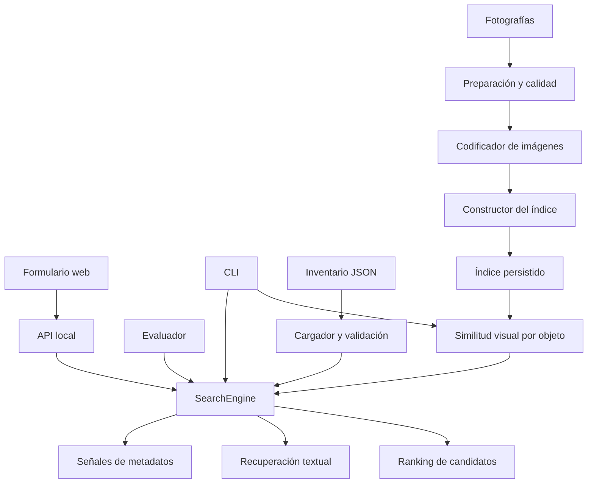

# Arquitectura del laboratorio

El alcance es la recuperación de candidatos para revisión humana. No incluye
custodia operativa, acreditación de propiedad ni autorización de entrega.

## Responsabilidades

| Módulo | Responsabilidad |
|---|---|
| `schemas.py` | Contratos tipados compatibles con el formato JSON actual |
| `config.py` | Recursos, rutas y parámetros TOML de ejecución |
| `data/loader.py` | Lectura del inventario y validación de IDs, fechas y descripciones |
| `data/image_store.py` | Rutas de imágenes confinadas al directorio del manifiesto |
| `imaging/preprocessing.py` | Decodificación, orientación y conversión de imágenes |
| `imaging/quality.py` | Avisos de resolución y contraste |
| `imaging/encoder.py` | Protocolo común de embeddings de texto e imagen |
| `imaging/siglip.py` | Adaptador opcional de SigLIP2 |
| `indexing/` | Firma, hashes, reutilización y persistencia atómica del índice |
| `search/` | Recuperación textual/visual, metadatos, fusión y selección |
| `evaluation/` | Métricas independientes de la interfaz y del formato de salida |
| `api/server.py` | Transporte HTTP y recursos web; no implementa ranking |
| `cli.py` | Coordina comandos y carga explícita de modelos opcionales |

## Límites y decisiones

La indexación se ejecuta antes de consultar y se repite cuando cambia el
inventario. Los resultados visuales se agregan por objeto, no por fotografía.
Las consultas visuales actualmente se coordinan desde la CLI; la API es textual.

La librería estándar basta para búsqueda textual y evaluación. Pillow se importa
solo al procesar imágenes; PyTorch y Transformers, solo al construir el adaptador.
La importación del motor de búsqueda no descarga modelos.

No se introducen microservicios ni almacenamiento vectorial especializado. El
inventario y el índice son archivos de laboratorio; la revisión del modelo y el
preprocesamiento impiden comparar embeddings incompatibles.

HTML, CSS y JavaScript viven en `web/`. La API solo sirve tres rutas estáticas
explícitas; no expone el sistema de archivos. El paquete instala esos recursos y
los datos sintéticos como archivos compartidos; en desarrollo se usan los del repo.

El comportamiento de búsqueda no se recalibra al reorganizar. Cualquier cambio
posterior de filtros, pesos o umbrales debe evaluarse explícitamente.
